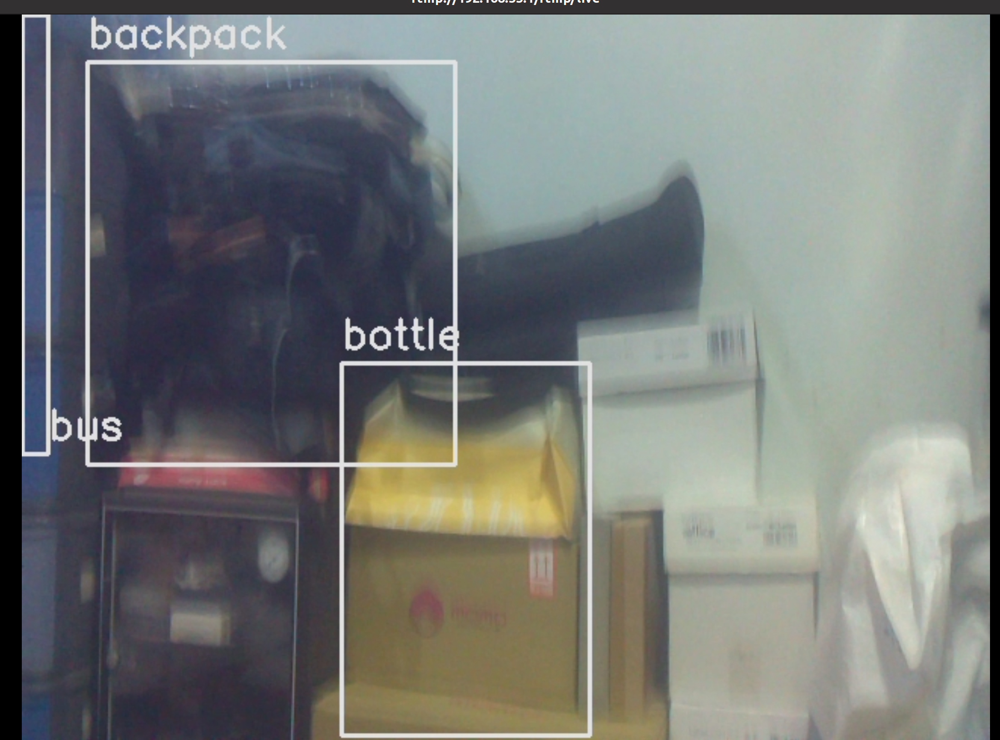
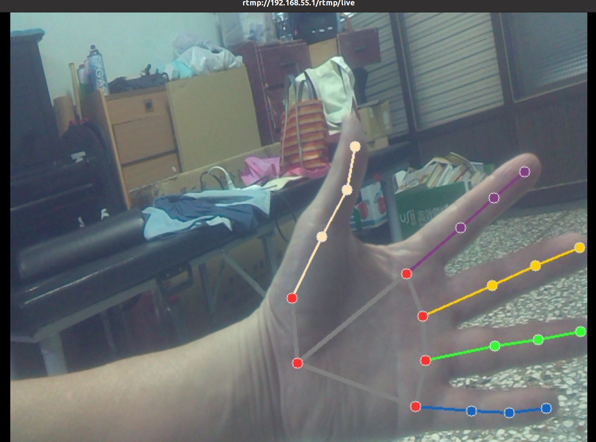
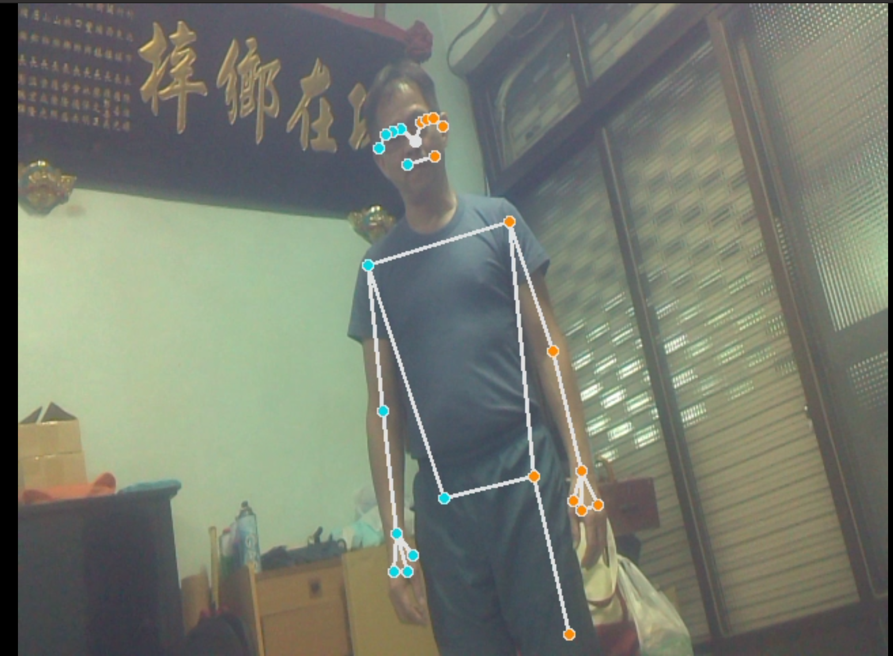

# Software-defined video streaming
## Preparation
- On both localhost and Jetson nano, run commands below
```bash
$ git clone https://github.com/Huan80805/SDVS.git

# Install protobuf compiler
$ sudo apt-get install protobuf-compiler

# Install buildtools
$ sudo apt-get install build-essential make

# Install grpc packages
$ pip3 install -r requirements.txt

# Compile protobuf schema to python wrapper
$ make
```
## Run
- On Server - Jetson nano
```bash
$ python3 server.py --ip 0.0.0.0 --port 8080
```
- On client - host machine
```bash
# Display streaming on host machine, default: object detection
$ ffplay -fflags nobuffer rtmp://192.168.55.1/rtmp/live
# This will change the algorithm to hand pose tracking
$ python3 client.py --ip 192.168.55.1 --port 8080 --command HPT
```
## Demo
- video

    <https://youtu.be/u9ciG6Qb7ck>
- object detection
<p align='center'>

</p>

- hand pose tracking
<p align='center'>

</p>

- pose estimation
<p align='center'>

</p>